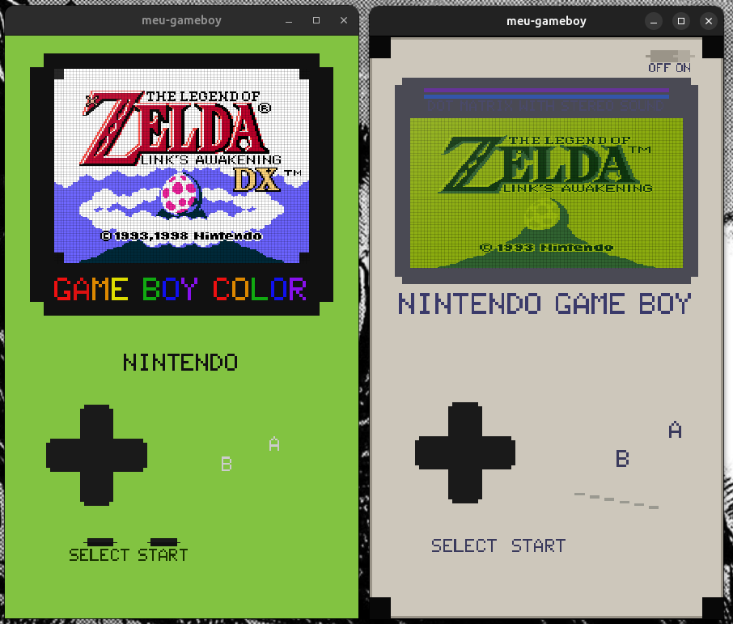
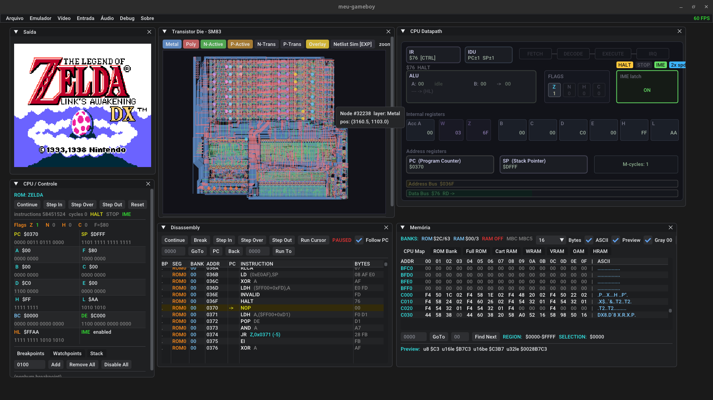

# meu-gameboy

A Game Boy, Game Boy Color, and Game Boy Advance emulator written in C.





## Features

- **Game Boy / Game Boy Color**: Full SM83 CPU emulation, PPU with scanline renderer, APU (CH1–CH4), MBC1/MBC3/MBC5 cartridge support, RTC, DMA/HDMA
- **Game Boy Advance**: ARM7TDMI (ARM + Thumb), GPU with BG modes 0–5 and OBJ/affine, APU (CH1–CH4 + FIFO A/B), 4-channel DMA, timers, cartridge save types (SRAM, EEPROM, Flash, RTC)
- **Debug UI**: ImGui-based debugger with CPU state, memory viewer, VRAM viewer, SM83 netlist die visualization

## Dependencies

- GCC or Clang
- [SDL3](https://github.com/libsdl-org/SDL/releases)
- OpenGL (for the debug UI)
- `pkg-config`

On Ubuntu/Debian:
```sh
apt install build-essential pkg-config libgl-dev
# SDL3 must be built from source: https://github.com/libsdl-org/SDL
```

## Build

```sh
# Clone with submodules (ImGui)
git clone --recurse-submodules https://github.com/moisesnunes/meu-gameboy.git
cd meu-gameboy

# Game Boy emulator (with debug UI)
make gameboy

# GBA emulator
make meu-gba

# Minimal Game Boy (no UI, SDL only)
make gameboy-simple
make gameboy-vector
```

## Make targets

| Target | Description |
| --- | --- |
| `make gameboy` | Game Boy / GBC emulator with full debug UI |
| `make meu-gba` | GBA emulator |
| `make gameboy-simple` | Minimal GB emulator (no debug UI) |
| `make gameboy-vector` | GB emulator with vector renderer frontend |
| `make compat_test` | Build the GB compatibility test runner |
| `make gba_compat_test` | Build the GBA compatibility test runner |
| `make rom_tester` | Build the ROM smoke-test runner |
| `make sm83-validate` | Build the SM83 netlist validator |
| `make compat-run` | Run GB blargg/Mooneye compat suite |
| `make mooneye-run` | Run Mooneye test suite |
| `make game-smoke` | Run GB game smoke tests |
| `make gba-compat-run` | Run GBA compat suite |
| `make gba-game-smoke` | Run GBA game smoke tests |
| `make shootout-run` | Run PPU shootout tests |
| `make shootout-list` | List available shootout tests |
| `make clean` | Remove all build artifacts |

## Usage

```sh
# Game Boy / GBC
./gameboy path/to/rom.gb

# GBA
./meu-gba path/to/rom.gba
```

Boot ROMs (`bootroms/dmg_boot.bin`, `bootroms/cgb_boot.bin`) are loaded automatically if present.

## Test ROMs

The `roms/` directory is not included in this repository. Compatible test suites:

- [blargg's test ROMs](https://github.com/retrio/gb-test-roms)
- [Mooneye GB test suite](https://github.com/Gekkio/mooneye-gb)
- [Game Boy Test ROMs](https://github.com/c-sp/game-boy-test-roms)
- [GBA Test ROMs](https://github.com/mgba-emu/suite)


## Project Structure

```
gba/          GBA emulator core (CPU, GPU, APU, DMA, timers, cart)
ui/           ImGui debug interface
sm83/         SM83 CPU netlist simulation and die viewer
hw_schematic/ DMG hardware schematic visualization
data/         Hardware data (netlist JSON, schematics)
bootroms/     DMG and CGB boot ROMs
frontends/    Alternate entry points (simple, hardware, vector)
tools/        Utility scripts
tests/        Test runners (compat, mooneye, game smoke, GBA compat)
```

## License

Source code is released under the MIT License. Boot ROM binaries and test ROMs are not covered by this license.
