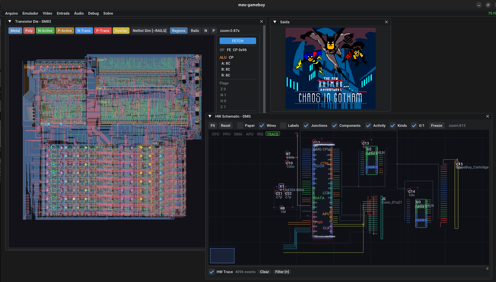
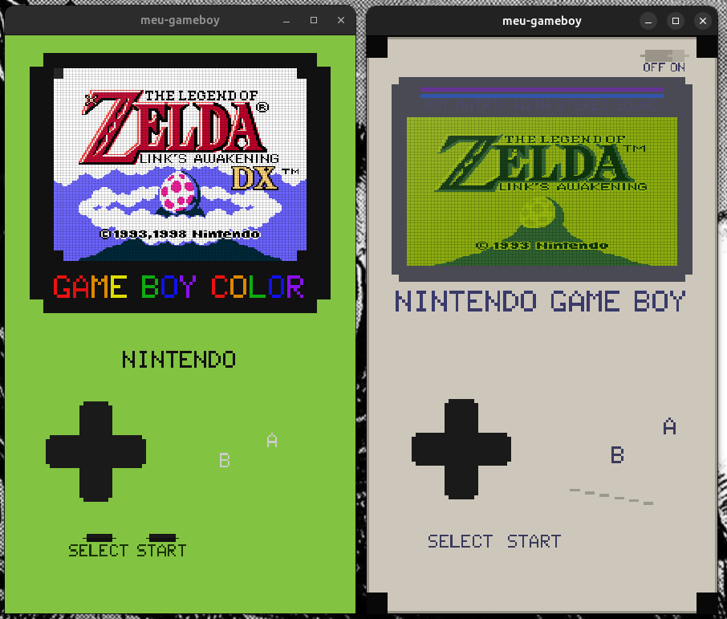

# meu-gameboy

`meu-gameboy` is a C emulator project for the Game Boy family and Game Boy
Advance. It provides SDL3 desktop frontends, a Dear ImGui debugger, headless
compatibility runners, and hardware-oriented visualization tools for studying
the emulated systems.





## Supported Systems

- Game Boy (DMG)
- Game Boy Color (CGB)
- Game Boy Advance (GBA)

## Features

### Game Boy and Game Boy Color

- SM83 CPU, scanline PPU, APU channels CH1-CH4, timer, IRQ, DMA, and HDMA.
- MBC1, MBC3, and MBC5 cartridges, battery-backed RAM, and MBC3 RTC.
- DMG and CGB boot ROM loading when local boot ROM files are available.
- SDL3 desktop frontend, controller support, drag and drop, fullscreen, and
  held fast-forward.
- Debug UI with CPU state, disassembly, breakpoints, watchpoints, memory and
  VRAM views, trace controls, screenshots, save-state slots, SRAM actions,
  audio controls, and SM83 die/netlist views.
- Alternative minimal and vector-rendered frontends.

### Game Boy Advance

- ARM7TDMI ARM and Thumb execution.
- Modes 0-5, tiled/affine backgrounds, OBJ rendering, palette, VRAM, and OAM.
- APU channels, FIFO audio, four DMA channels, timers, IRQ, and cartridge
  backup support for SRAM, EEPROM, Flash, and RTC.
- SDL3 frontend with controller support, fullscreen, fast-forward, ROM drag
  and drop, optional BIOS, instruction trace, and an ImGui debug UI.

### Verification and Inspection

- Headless GB/GBC and GBA compatibility runners with serial, register, text,
  and visual result classification.
- Commercial-ROM smoke runners for both cores.
- PPU shootout runner and SM83 netlist validation.
- Dedicated GBA memory regression target covering bus maps, mirroring,
  open-bus behavior, EEPROM peeks, DMA register access, and timer reload
  latches.
- Hardware schematic and transistor-die visualization data for the DMG.

## Requirements

- GCC or Clang, plus G++ for the ImGui frontends.
- [SDL3](https://github.com/libsdl-org/SDL/releases) development files.
- OpenGL development files for the ImGui frontends.
- `make` and `pkg-config`.
- The `imgui` submodule, included by cloning recursively.

### Linux

On recent Debian/Ubuntu releases with SDL3 packages:

```sh
sudo apt install build-essential pkg-config libsdl3-dev libgl-dev
```

On distributions without an SDL3 package, build SDL3 from its official source
release, then ensure `pkg-config --cflags sdl3` succeeds.

### Windows

Use an MSYS2 MinGW64 environment:

```sh
pacman -S mingw-w64-x86_64-gcc mingw-w64-x86_64-sdl3 \
  mingw-w64-x86_64-pkg-config mingw-w64-x86_64-make
```

The Makefile detects MinGW and produces `.exe` binaries automatically.

## Build

```sh
git clone --recurse-submodules https://github.com/moisesnunes/meu-gameboy.git
cd meu-gameboy

# Main Game Boy / Game Boy Color frontend with debugger
make gameboy

# Game Boy Advance frontend
make meu-gba

# Lightweight and vector Game Boy frontends
make gameboy-simple
make gameboy-vector
```

On Windows, run the same targets from an MSYS2 MinGW terminal. For example:

```sh
make gameboy.exe
make meu-gba.exe
```

## Command Line Usage

For normal use, build once and launch a ROM directly:

```sh
./gameboy 
or
./gameboy path/to/rom.gb
./meu-gba path/to/rom.gba
```

The remaining options are only needed for debugging, custom boot ROMs, BIOS,
or instruction traces:

```text
./gameboy [--debug] [--bootrom path/to/bootrom.bin] path/to/rom.gb
./meu-gba [--debug] [--bios path/to/gba_bios.bin] [--trace [count] [file]] path/to/rom.gba
./gameboy-simple [--bootrom path/to/bootrom.bin] path/to/rom.gb
./gameboy-vector path/to/rom.gb
```

`--debug` opens the relevant ImGui debugger. GBA tracing writes an instruction
trace to the selected file, or to standard error when no file is provided.

For the main GB/GBC frontend, `bootroms/dmg_boot.bin` and
`bootroms/cgb_boot.bin` are loaded automatically when present. A GBA BIOS is
optional; the GBA frontend falls back to its HLE path when no usable BIOS is
supplied.

## Controls

| Action | Keyboard | Gamepad |
| --- | --- | --- |
| D-pad | Arrow keys | D-pad |
| A | Left Ctrl or `Z` on GBA | East button |
| B | Left Shift or `X` on GBA | South button |
| Start | Enter | Start |
| Select | Right Shift or Backspace on GBA | Back |
| GBA L / R | `A` / `S` | Left / right shoulder |
| Fast-forward | Hold Tab | - |
| Fullscreen | F11 | - |
| Quit | Q or Escape | - |

## Tests

The ROM bundles are intentionally not committed. See [roms/README.md](roms/README.md)
for the local layout expected by the runners.

```sh
# Build-only test executables
make compat_test
make gba_compat_test
make rom_tester

# GB/GBC compatibility and smoke tests
make compat-run
make blargg-run
make mooneye-run
make game-smoke

# GBA compatibility, memory regression, and commercial smoke tests
make gba-compat-run
make gba-memory-test
make gba-game-smoke

# Visual and transistor-netlist checks
make shootout-list
make shootout-run
make sm83-validate
```

The compatibility runners write machine-readable result tables under
`tests/compat/out/`, `tests/gba_compat/out/`, and `tests/shootout/out/`.
Useful shootout profiles and focused-run arguments are documented in
[tests/shootout/README.md](tests/shootout/README.md).

### Game Boy Test ROMs v7.0 Shootout

`make shootout-run` uses `roms/game-boy-test-roms-v7.0` by default. Run a
single suite from that bundle with:

```sh
# Inspect the ROMs that will be selected before executing them
make shootout-list SHOOTOUT_ARGS='--suite mooneye-test-suite'
make shootout-list SHOOTOUT_ARGS='--suite blargg'

# Run Mooneye or Blargg through the headless shootout runner
make shootout-run SHOOTOUT_ARGS='--suite mooneye-test-suite'
make shootout-run SHOOTOUT_ARGS='--suite blargg'

# Narrow a suite to a feature or ROM-name fragment
make shootout-run SHOOTOUT_ARGS='--suite blargg --filter dmg_sound'
make shootout-run SHOOTOUT_ARGS='--suite mooneye-test-suite --filter oam_dma'

# Keep reports from independent runs instead of replacing the default out/ tree
make shootout-run SHOOTOUT_ARGS='--suite mooneye-test-suite --out tests/shootout/out/mooneye'
make shootout-run SHOOTOUT_ARGS='--suite blargg --out tests/shootout/out/blargg'
```

Each run writes `shootout.tsv`, `summary.md`, and visual captures when needed.
The default output directory is replaced at the start of a run; pass `--out`
when comparing multiple suites side by side.

Current Mooneye v7.0 shootout snapshot, generated from
`tests/shootout/out/summary.md`:

| Suite | Total | Pass | Fail | Timeout |
| --- | ---: | ---: | ---: | ---: |
| Mooneye | 114 | 108 | 4 | 2 |

## Compatibility Manifest Snapshot

Snapshot generated on 2026-06-22 with `make compat-run`, using the local
Blargg and Mooneye manifest subsets. This is separate from the broader v7.0
shootout above.

| Suite | Total | Pass | Fail | Timeout | Unknown |
| --- | ---: | ---: | ---: | ---: | ---: |
| Blargg | 58 | 57 | 1 | 0 | 0 |
| Mooneye | 103 | 102 | 1 | 0 | 0 |
| **Combined** | **161** | **159** | **2** | **0** | **0** |

Current known failures are Blargg `oam_bug/rom_singles/7-timing_effect.gb`
and Mooneye `acceptance/ppu/intr_2_mode0_timing_sprites.gb`. The full per-ROM
results and future suite totals are written to `tests/compat/out/compat.txt`.

## Project Layout

```text
gba/              GBA core: CPU, memory bus, GPU, APU, DMA, timers, IRQ, cart
ui/               Dear ImGui debugger shells, panels, menus, and actions
frontends/        Minimal, vector, and hardware-oriented GB frontends
sm83/             SM83 netlist simulation and transistor-die visualization
hw_schematic/     DMG hardware schematic graph, pins, mapping, and tracing
data/             Netlist and schematic data consumed by the visualizers
bootroms/          Optional local DMG and CGB boot ROMs
tests/            Compatibility, shootout, and commercial-ROM smoke runners
docs/             Architecture, debugger, die, and GBA engineering plans
```

## Test ROM Sources

- [blargg's Game Boy test ROMs](https://github.com/retrio/gb-test-roms)
- [Mooneye GB test suite](https://github.com/Gekkio/mooneye-gb)
- [Game Boy Test ROMs](https://github.com/c-sp/game-boy-test-roms)
- [mGBA test suite](https://github.com/mgba-emu/suite)
